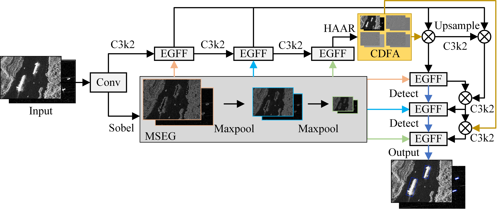
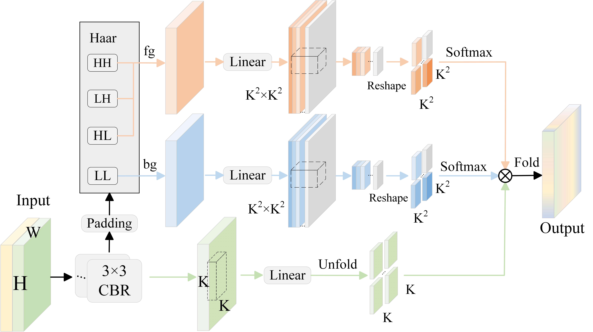
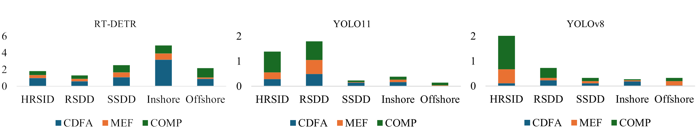

# Edge-Aware SAR Ship Detection: Multi-Scale Edge-Semantic Fusion and Contrast-Driven Feature Aggregation

## 📖 Abstract
Accurate target localization in Synthetic Aperture Radar (SAR) ship detection heavily relies on robust edge information, yet conventional detection networks lack dedicated mechanisms to enhance edge feature awareness. To address this limitation, we propose a novel framework that integrates two synergistic modules:

1. Multi-Scale Edge-Semantic Fusion (MEF): This module extracts edge features from shallow convolutional layers and propagates them across the backbone network, enabling multi-scale edge-semantic fusion.

2. Contrast-Driven Feature Aggregation (CDFA): This module integrates Haar wavelet transforms and attention mechanisms to dynamically enhance edge detection and feature discriminability through multi-scale spectral analysis and contrast-aware weighting.

3. Our framework is a universal component that can be easily integrated into mainstream object detection architectures, including the YOLO and RT-DETR series. Extensive experiments on SSDD , RSDD-SAR and HRSID public datasets demonstrate the effectiveness of our approach. The proposed framework achieves state-of-the-art accuracy on multiple benchmarks with computational efficiency.

[Paper PDF] (coming soon)

## ⚙️ Installation
```bash
# Clone the repository
git clone [https://github.com/ZJ-Song-Lab/MEF-CDFA.git](https://github.com/ZJ-Song-Lab/MEF-CDFA.git)
cd MEF-CDFA

# Install dependencies
pip install -r requirements.txt
```

## 📸 Visualization

**Overall Framework**
A high-level view of our proposed end-to-end framework.



**Multi-Scale Edge-Semantic Fusion (MEF) Module**
Illustrates how the MEF module integrates edge information and semantic features at different scales.


**Contrast-Driven Feature Aggregation (CDFA) Module**
Depicts the CDFA module's process of using Haar wavelet transforms to enhance feature contrast.




## 🚀 Results
Our method achieved significant performance gains on multiple baseline architectures, including a 1.97% AP improvement on RT-DETR, demonstrating its generalizability and robustness.




## 📜 License
This project is released under the **MIT License**. See [LICENSE](./LICENSE) for details..
